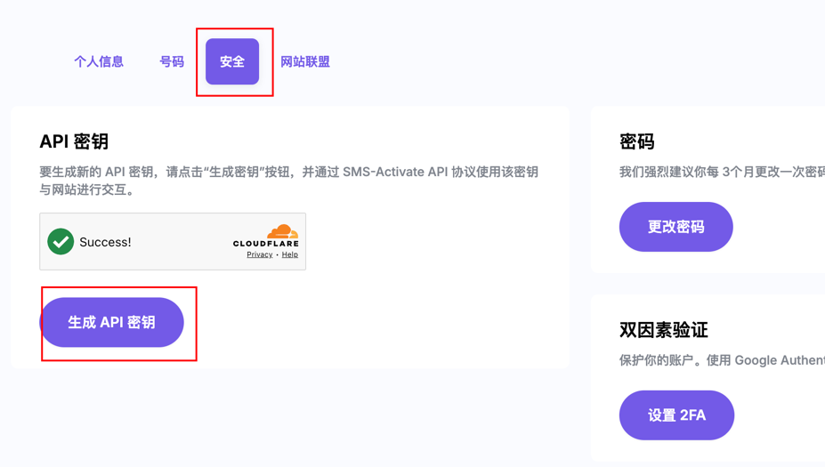
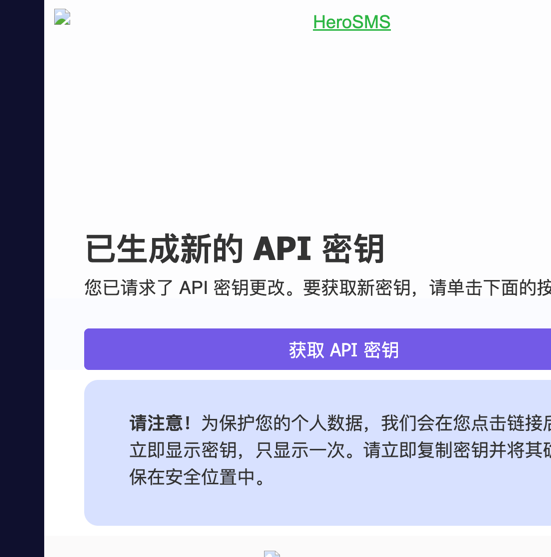

# HeroSMS 接码配置说明

本项目通过 HeroSMS 处理 OpenAI 注册流程中可能出现的手机号验证。

HeroSMS 只用于接码。HeroSMS 请求默认走本地网络，不使用配置页里的 OpenAI 代理。

## 适用场景

- 注册或授权过程中 OpenAI 要求添加手机号
- 希望自动申请号码、轮询验证码、完成或取消接码任务

## 获取 API Key

1. 注册并登录 [HeroSMS](https://hero-sms.com/cn)。
2. 打开安全设置页面：

```text
https://hero-sms.com/cn/profile/safety
```

3. 生成 API Key。
4. HeroSMS 会向账号邮箱发送确认邮件。
5. 点击邮件里的确认链接后获得 API Key。

参考截图：






## 充值

使用前需要保证 HeroSMS 账号有余额。当前 Web 配置页会调用 `getBalance` 显示当前余额。

HeroSMS `getBalance` 常见返回：

```text
ACCESS_BALANCE:0.7628
```

## 在 Web 管理台配置

启动管理台：

```bash
npm run build
npm run web
```

打开：

```text
http://127.0.0.1:3789/settings
```

在“配置 / HeroSMS”中填写：

- `heroSMSApiKey`：HeroSMS API Key
- `heroSMSCountry`：国家 ID，页面会从 HeroSMS `getCountries` 拉取下拉列表
- `heroSMSMaxPrice`：申请号码时允许的最高价格
- `heroSMSPollAttempts`：等待验证码的轮询次数
- `heroSMSPollIntervalMs`：轮询间隔，单位毫秒

页面会展示：

- 当前余额
- 国家中文名 / 英文名 / ID
- 国家能力标签，例如重试、租用、多服务
- OpenAI / `dr` 当前价格和可用数量

## HeroSMS API 返回格式

国家接口 `getCountries` 可能返回对象 map：

```json
{
  "52": {
    "id": 52,
    "rus": "Таиланд",
    "eng": "Thailand",
    "chn": "泰国",
    "visible": 1,
    "retry": 1,
    "rent": 1,
    "multiService": 0
  }
}
```

价格接口 `getPrices` 可能返回：

```json
{
  "52": {
    "dr": {
      "cost": 0.45,
      "count": 1247,
      "physicalCount": 1214
    }
  }
}
```

项目会宽松解析这些结构。拿不到价格时只在 UI 显示“价格接口未返回”，不会阻止保存配置。

## 运行行为

注册流程中如果 OpenAI 要求手机号验证：

1. 后端使用配置页保存的 HeroSMS API Key。
2. 申请服务代码固定为 `dr`，即 OpenAI。
3. 按配置的国家、最高价格申请号码。
4. 轮询 HeroSMS 获取短信或语音验证码。
5. 按任务状态完成注册链路。

## 注意事项

- HeroSMS 请求默认不走 OpenAI 代理。
- 余额不足、国家不可用、价格高于 `heroSMSMaxPrice` 时会导致接码失败。
- 单个号码可用次数和取消规则以 HeroSMS 当前平台规则为准。
- 如果更换 API Key，保存配置后新任务会立即使用最新配置。
